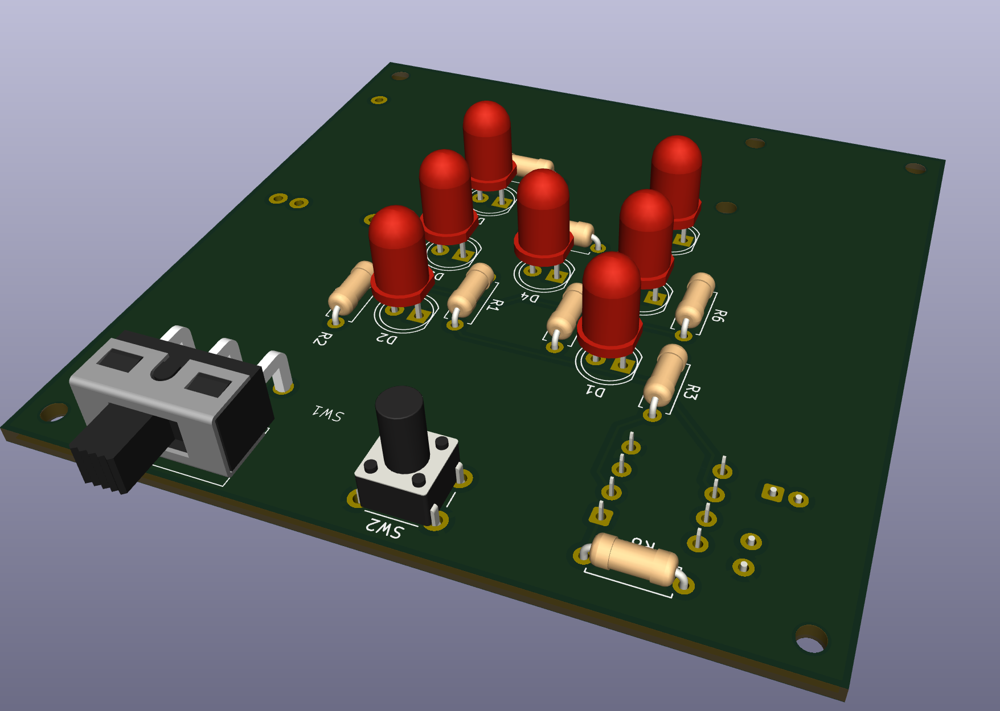
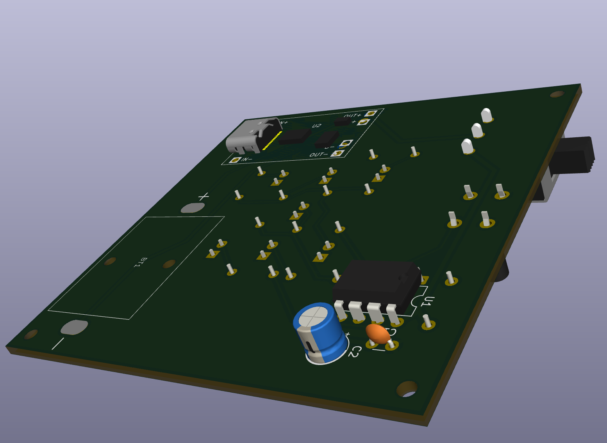
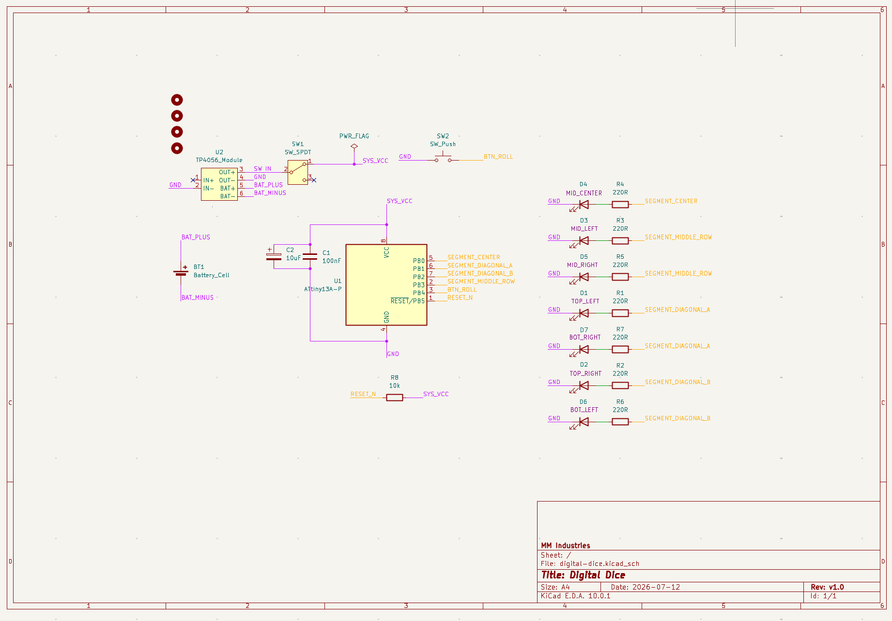

# ArcDice

ArcDice is a compact ATtiny13-based digital dice project with a 7-LED face, low-power sleep behavior, and a matching KiCad hardware design.

Keywords: digital dice, ATtiny13 dice, LED dice, DIY electronic dice.

## What It Does

- Rolls a random value from 1 to 6 with a short LED animation.
- Drives a 7-point dice face from only 4 MCU output lines.
- Uses button wake-up and sleep mode to reduce power draw.

## Firmware

- Source: `src/main.cpp`
- PlatformIO environment: `attiny13a`
- Upload protocol: `usbasp`

### Pin Mapping

- PB0 -> center LED segment
- PB1 -> diagonal A (top-left + bottom-right)
- PB2 -> diagonal B (top-right + bottom-left)
- PB3 -> middle row (left-middle + right-middle)
- PB4 -> roll button (to GND, internal pull-up)

### Dice Face Layout

The 7 visible pips are arranged on a 3x3 grid and lit via 4 logical
groups (center, two diagonals, middle row). The resulting faces are:

| Roll | Pattern                       | Description           |
|------|-------------------------------|-----------------------|
| 1    | center                        | single center pip     |
| 2    | diagonal A                    | two corner pips (TL+BR) |
| 3    | center + diagonal A           | vertical middle column (TL + center + BR) |
| 4    | diagonal A + diagonal B       | four corners (full X) |
| 5    | center + both diagonals       | full X plus center    |
| 6    | both diagonals + middle row   | four corners + middle two |

Note: face 3 uses diagonal A (TL+BR) plus center, giving a symmetric
vertical middle column -- the standard 7-pip rendering of 3.

### RESET Pin / RSTDISBL Fuse

**PB4 is the ATtiny13A RESET pin.** Using it as a button input requires
the `RSTDISBL` fuse to be programmed, which **disables ISP
reprogramming**. Once `RSTDISBL` is set:

- USBasp (ISP) **cannot** reflash the chip
- A high-voltage programmer (e.g. HV rescue shield, Atmel-ICE in HV
  mode, or a dedicated HVSP programmer) is required to re-flash
- Verify this trade-off before flashing a board you intend to iterate on

The firmware shipped in this repo assumes `RSTDISBL` is already
programmed. If you flashed your chip with a stock AVR fuse setup and
PB4 is still /RESET, the button will not work -- program `RSTDISBL`
first via HV, or move the button to a non-RESET pin (only PB0-PB3
are usable as GPIO on the ATtiny13A in that case).

## Hardware

- KiCad project files:
	- `hardware/ArcDice.kicad_pro`
	- `hardware/ArcDice.kicad_sch`
	- `hardware/ArcDice.kicad_pcb`
- Power target: 1S Li-ion/LiPo with TP4056 protected module
- Recommended LED resistors: 220 ohm (one per LED)

## Images

### 3D Top



### 3D Bottom



### Schematic v1



## Build And Upload

1. Install PlatformIO.
2. Connect an ATtiny13 programmer (USBasp).
3. Build and upload:

```bash
pio run -e attiny13a -t upload
```

## Additional Documentation

- [CHANGELOG.md](CHANGELOG.md) — release history and notable changes.
- [docs/BOM.md](docs/BOM.md) — bill of materials with footprints and suggested supplier parts.

## License

MIT. See `LICENSE`.

